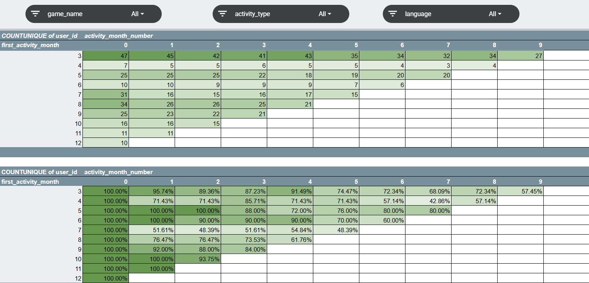
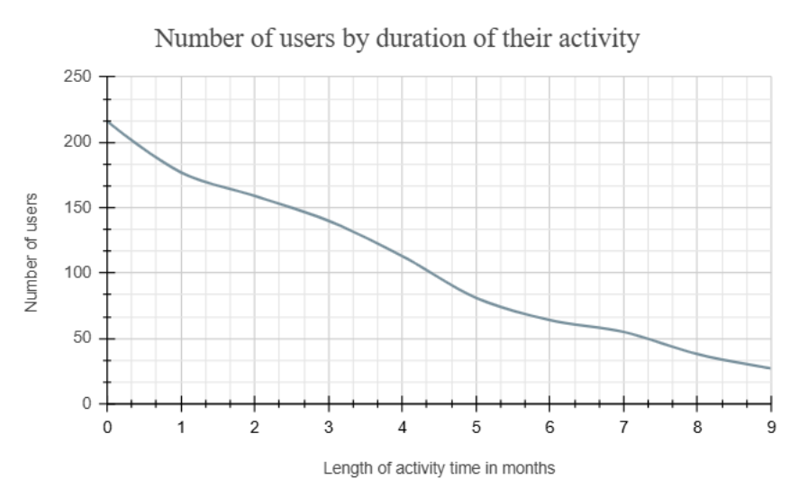
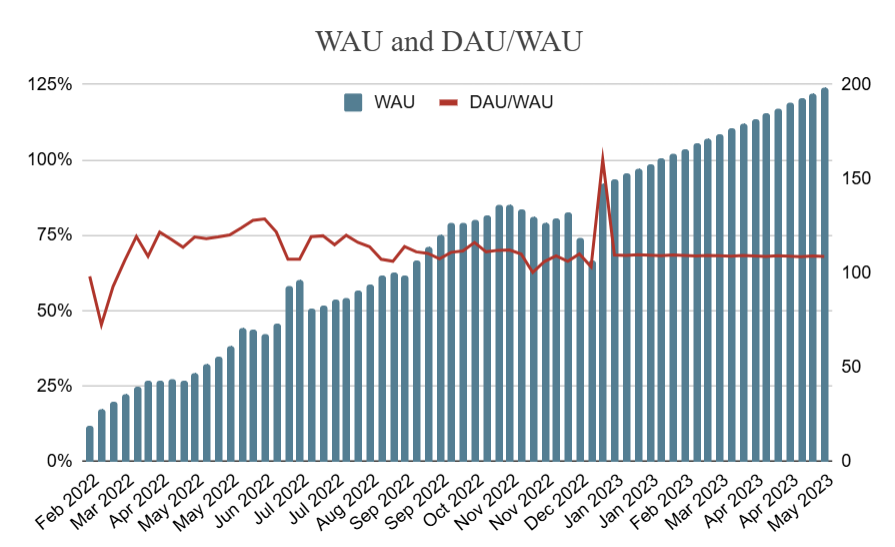
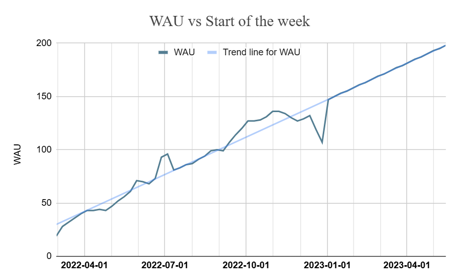
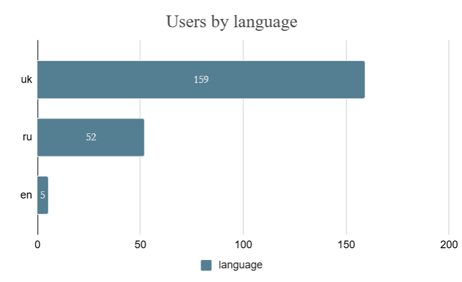
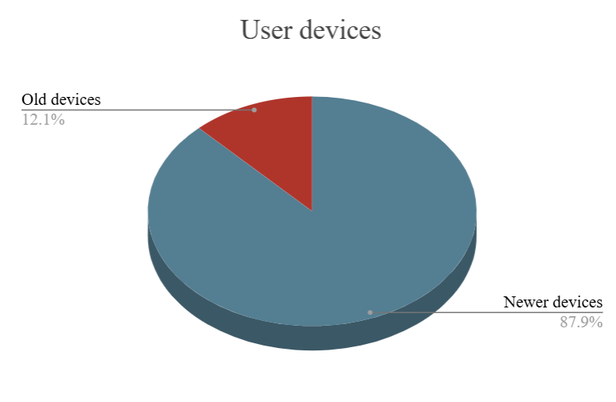

<h1 align="center">Gaming Analytics & Insights</h1>

Analyzing user behavior and game performance using cohort analysis, KPI calculations, and data visualizations in Google Sheets.

---

## 🎯 Project Goal
This is a learning project aimed at analyzing user engagement, revenue, and conversion rates across different games. I used Google Sheets to process and visualize key gaming metrics, helping to identify factors affecting monetization and player retention.

---

## 🛠 Tools Used
Google Sheets – advanced data manipulation, KPI calculations, and interactive visualizations  

Pivot Tables – for cohort analysis and KPI tracking

Charts & Graphs – to visualize trends and insight

---

## 📊 Visualizations Created  

>⬇️***Cohort Analysis Table*** – *tracking user retention across different months*

>⬇️***Smooth Line Chart*** – *visualizing user activity duration*

>⬇️***Combo Chart (WAU & DAU/WAU)*** – *identifying trends in user engagement*

>⬇️***Line Chart (WAU vs Start of the Week)*** – *examining weekly activity pattern*

>⬇️***Bar Chart*** – *comparing user count by language*

>⬇️***3D Pie Chart*** – *device model distribution among users*

---

## 📈 Key Metrics & Insights
Ad Spend & Total Revenue – Understanding advertising efficiency and game profitability

User Conversion (CR to Paid) – Identifying potential issues with player conversion

ARPPU (Average Revenue Per Paying User) – Measuring spending behavior

Age Distribution Analysis – Understanding demographics of paying users

DAU & WAU Analysis – Tracking user engagement over time

---

## 🔍 Findings & Business Insights
Based on data analysis, I identified key reasons for low conversion rates and ARPPU differences between games. The main takeaways include:
- Lower conversion rates (CR to Paid) in certain games may be due to poor ad targeting, lack of engaging content, or complex payment processes
- Differences in ARPPU might indicate content quality issues, lack of incentives for users to make purchases, or ineffective pricing strategies
- User behavior insights suggest that improving advertising strategies, enhancing in-game content, and introducing promotional offers can boost engagement and revenue

---

## 📌 Next Steps
Further analysis is needed to:
- Conduct user surveys to understand what features they value the most
- Compare game performance with competitors
- A/B test different monetization strategies
  
📂 **[Google Sheets File](https://docs.google.com/spreadsheets/d/1b5YzW0TBOP9piAJlfYng5AkapWByRvkAt-BWalhgckM/edit?usp=sharing)**

---
